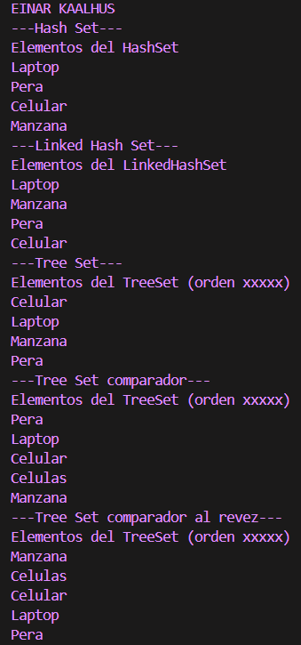

Ejemplos de Implementación de Sets en Java
📌 Información General
Título: Implementación de Tipos de Sets en Java

Asignatura: Estructura de Datos

Carrera: Computación

Estudiantes: Einar Kaalhus

Fecha: 1 de Julio del 2025 

Profesor: Ing. Pablo Torres (asumiendo el mismo profesor del README anterior, si no, por favor corregir)

🛠 Descripción
Este proyecto en Java explora y demuestra el uso de diferentes implementaciones de la interfaz Set, incluyendo HashSet, LinkedHashSet, y TreeSet. Se enfatiza cómo cada tipo de Set maneja el orden de inserción y el orden de los elementos, así como la capacidad de TreeSet para ordenar elementos utilizando un Comparator personalizado.

El programa crea y popula instancias de cada tipo de Set con una colección de palabras, mostrando cómo los elementos se almacenan y se iteran en cada caso.

🚀 Ejecución
Para ejecutar el proyecto:

Asegúrate de tener el Java Development Kit (JDK) instalado en tu sistema.

Compila los archivos Sets.java y App.java desde la raíz del proyecto. Si estás utilizando un IDE como VS Code o IntelliJ, la compilación se manejará automáticamente.

Ejecuta el archivo principal App.java.

Bash

# Desde la carpeta raíz del proyecto, si es necesario compilar manualmente
javac controller/Sets.java App.java
java App
🧪 Ejemplo de Salida por Consola
Plaintext

EINAR KAALHUS
---Hash Set---
Elementos del HashSet
Pera
Manzana
Celular
Laptop
---Linked Hash Set---
Elementos del LinkedHashSet
Laptop
Manzana
Pera
Celular
---Tree Set---
Elementos del TreeSet (orden alfabético natural)
Celular
Laptop
Manzana
Pera
---Tree Set comparador---
Elementos del TreeSet (orden por longitud y luego alfabético)
Pera
Laptop
Celulas
Celular
Manzana
---Tree Set comparador al revez---
Elementos del TreeSet (orden por longitud descendente y luego alfabético inverso)
Manzana
Celular
Celulas
Laptop
Pera

